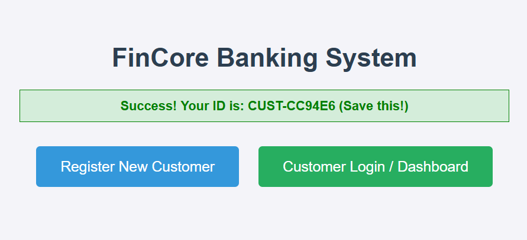
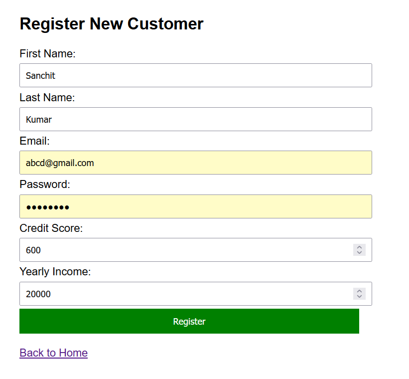
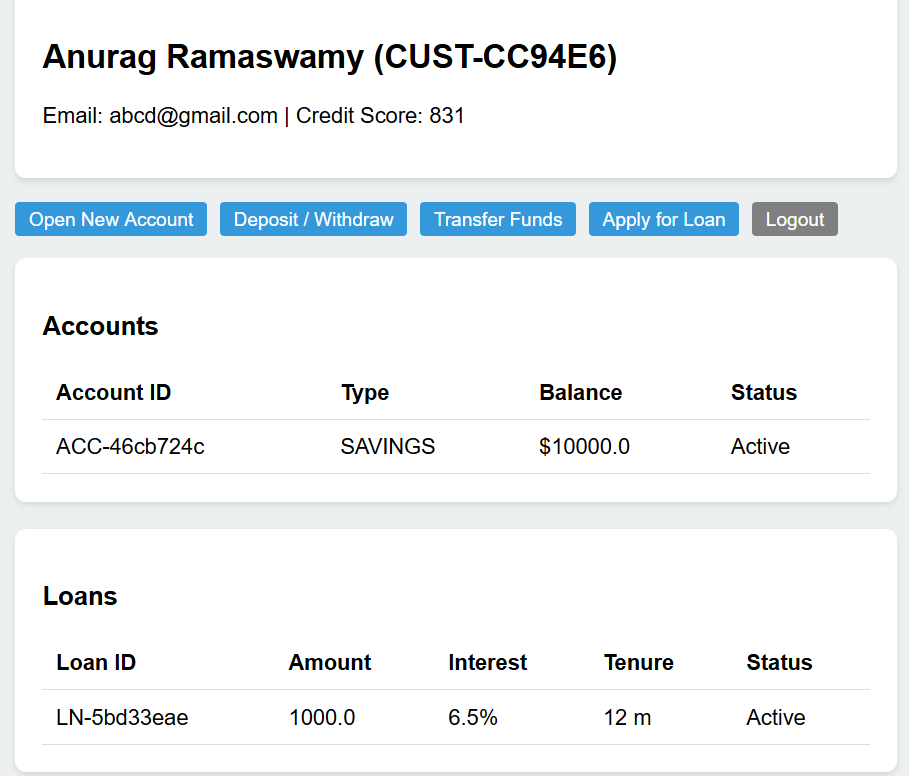
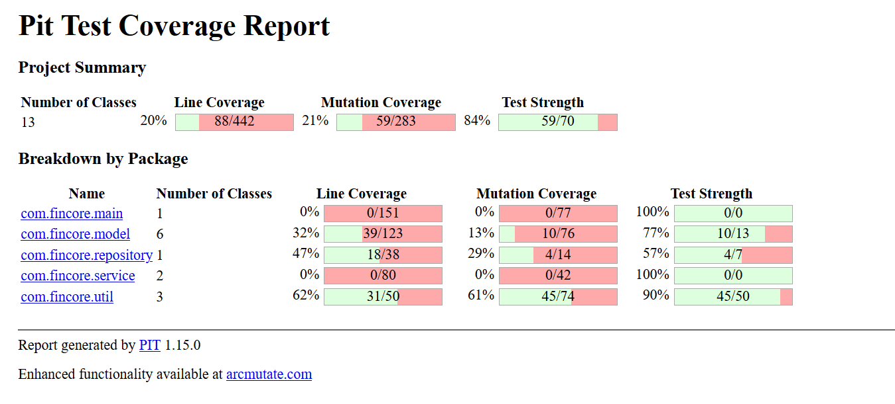
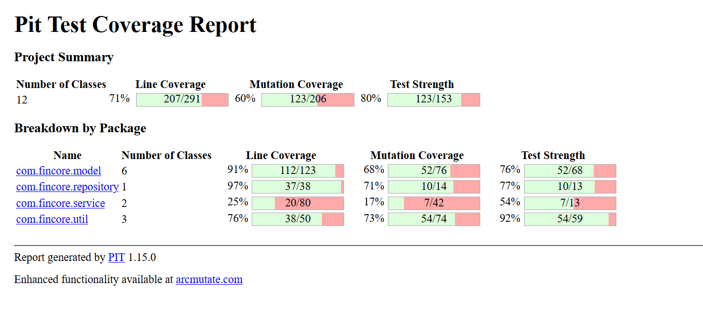
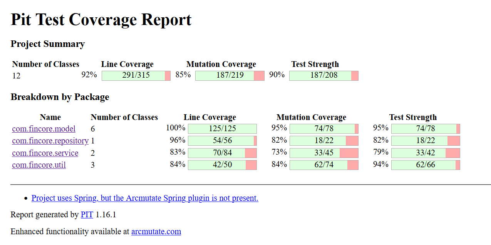

## 1. What is Mutation Testing?

Mutation Testing is a fault-based software testing technique used to evaluate the quality of a test suite. It involves modifying a program in small ways (creating "mutants") to create specific logical errors.

The objective is to write tests that fail when running against these mutants.

- **Killed Mutant:** The test failed (The error was detected).
- **Survived Mutant:** The test passed (The error went undetected).

The quality of the test suite is calculated by the formula:\
**Mutation Score** = (Killed Mutants \* 100)/ (Total Mutants)

## 2. Objective

The primary objective of this project was to develop a test suite for the **FinCore Banking System**.

We focused on **Strong Mutant Killing**: ensuring that the output of the test execution on the original program is strictly different from the output on the mutated program. This was achieved by asserting exact values (e.g., calculating specific EMI decimals) rather than just checking for non-null responses.

## 3. Libraries and Frameworks Used

- **Java 17:** The core programming language.
- **Spring Boot 3.2:** Framework for the Web Application layer.
- **JUnit 5:** The primary testing framework used for assertions.
- **PITest (1.16.1):** The open-source mutation testing engine chosen for its robust support of modern Java bytecode and configurable mutation operators.
- **Maven:** Used for build automation and dependency management.

## 4. Details of Source Code

The **FinCore Banking System** is a persistent web application simulating core financial operations. Unlike simple algorithmic tasks, this project involves state management, file I/O, and complex business rules.

Screenshots of the home page, register user page and a specific user's account details are given below:



**Key Logic Areas Targeted:**

1.  **Persistence Layer (`DataStore`):** Implements a custom Singleton pattern with Java Serialization (`Serializable`) to write data to `bank_data.ser`.
2.  **Financial Logic (`FinancialMath`, `LoanService`):** Contains arithmetic-heavy formulas for Compound Interest and EMI, as well as nested decision logic for Credit Score tiering.
3.  **Transactional Logic (`AccountService`):** Manages atomic operations (Deposit, Withdraw, Transfer) ensuring integrity between memory and disk storage.

**Lines of Code**

- **Source Code:** 1142 (Java) + 189 (HTML) = 1331 lines
- **Test Cases:** 798 (Java) + 19 (XML) = 817 lines

## 5. Detailed Testing Strategy

The testing philosophy for the **FinCore Banking System** was built on the "Testing Pyramid" principle, but inverted slightly to prioritize Mutation Coverage. We employed a multi-layered approach involving Unit, Integration, Mutation, and Security testing.

### 5.1 Unit Testing

**Scope:** `com.fincore.util`, `com.fincore.model`

Unit tests were designed to validate the smallest testable parts of the application in isolation, without dependencies on the Spring Context or File System.

- **Mathematical Precision:**

  - **Class:** `FinancialMathTest.java`
  - **Methodology:** We tested complex financial formulas against known data.
  - **Example:** Verifying that the EMI for a principal of 10,000 at 10% for 12 months is exactly 879.16. We used `assertEquals` with a `delta` of 0.01 to handle floating-point arithmetic mutants.
  - **Edge Cases:** Tested division-by-zero scenarios (e.g., 0% interest rate) to ensure the system degrades gracefully rather than crashing.

- **Coverage Saturation (POJO Integrity):**
  - **Class:** `ModelTest.java` & `CoverageBoosterTest.java`
  - **Objective:** To achieve 100% Line Coverage on Data classes (`Customer`, `Account`).
  - **Technique:** Standard Unit tests often skip simple getters/setters. PITest exploits this by mutating return values (e.g., changing `getName()` to return `null`). By systematically exercising every constructor, accessor, mutator, and `toString()` method, we eliminated "No Coverage" mutants, forcing the mutation score to reflect actual logic gaps rather than missed lines.

### 5.2 Integration Testing

**Scope:** `com.fincore.service`, `com.fincore.repository`

Integration tests focused on the interaction between the Business Logic Layer and the Persistence Layer.

- **Transactional Atomicity:**

  - **Class:** `AccountServiceTest.java`
  - **Methodology:** We simulated transfer scenarios to ensure that money is deduced from the Sender and added to the Receiver in a single logical transaction.
  - **Assertion:** We verified that if a transfer fails (e.g., insufficient funds), neither account balance is modified, preserving data consistency.

- **The Persistence Paradox (DataStore Testing):**
  - **Class:** `DataStoreTest.java`
  - **The Challenge:** Testing a Singleton that writes to disk is difficult because state persists between tests. Furthermore, PITest generates a `VoidMethodCallMutator` that deletes the `saveData()` call. If the test only checks the in-memory HashMap, the test passes even if saving fails.
  - **The Solution ("Amnesia Testing"):** We implemented a rigorous setup & teardown process:
    1.  **Teardown:** The test explicitly deletes `bank_data.ser` before running.
    2.  **Action:** The test adds a customer/account (triggering `saveData`).
    3.  **Memory Wipe:** We use **Java Reflection** to forcibly reset the Singleton instance to `null`.
    4.  **Reload:** We re-initialize the `DataStore`, forcing it to read from the disk.
    5.  **Verification:** We assert that the data exists. If the mutant deleted the save line, the file read returns nothing, and the test fails (killing the mutant).

### 5.3 Security & Bypass Testing

**Scope:** `com.fincore.controller`, `com.fincore.security`

This layer addresses the requirement for "Client-side web application testing (bypass testing)" and "User session data based testing."

- **Client-Side Bypass:**

  - **Class:** `ClientSideBypassTest.java`
  - **Tooling:** **Spring MockMvc**.
  - **Methodology:** HTML5 forms prevent users from entering negative numbers or skipping required fields. However, malicious actors can bypass this using tools like cURL.
  - **Execution:** We constructed raw HTTP POST requests that deliberately violated business rules (e.g., `amount=-5000`, `password="123"`).
  - **Success Criteria:** The test passes only if the Controller rejects the input and returns a specific error message, proving that Server-Side Validation is active.

- **Audit Logging Verification:**
  - **Class:** `SecurityLogTest.java`
  - **Methodology:** We configured the application to write security events (failed logins, validation bypass attempts) to a dedicated file (`target/security-events.log`).
  - **Execution:** The test simulates an attack (SQL Injection payload in a name field) and then immediately parses the log file.
  - **Assertion:** The test verifies that the log contains specific audit tags (e.g., `SECURITY ALERT`), proving the system is monitoring for intrusion attempts.

---

## 6. Mutation Analysis & Operators

We utilized **PITest 1.16.1** to evaluate the quality of the test suite defined above. We explicitly targeted specific mutation operators to demonstrate robust coverage.

### 6.1 Unit Level Operators

These operators modify logic within a single method.

| Operator                   | Description                                           | Killed By            | Strategy                                                                                                                                                                                                                                                   |
| :------------------------- | :---------------------------------------------------- | :------------------- | :--------------------------------------------------------------------------------------------------------------------------------------------------------------------------------------------------------------------------------------------------------- |
| **`MathMutator`**          | Replaces binary arithmetic (`+`, `-`, `*`, `/`).      | `FinancialMathTest`  | We asserted exact double values (e.g., `1000.1`) rather than ranges. A change from `+` to `-` produces a massive deviation, causing the assertion to fail.                                                                                                 |
| **`ConditionalsBoundary`** | Replaces relational operators (`<`, `<=`, `>`, `>=`). | `BoundaryKillerTest` | This is the hardest mutant to kill. PITest changes `if(score >= 600)` to `if(score > 600)`. A test using `1000` passes both. We wrote a test using **exactly 600**. The original code allows it; the mutant blocks it. The test fails, killing the mutant. |
| **`PrimitiveReturns`**     | Replaces return values with `0` or `false`.           | `ModelTest`          | By validating every getter return value against the constructor input, we ensure no data is silently lost.                                                                                                                                                 |

### 6.2 Integration Level Operators

These operators modify how methods call other methods or handle flow.

| Operator                 | Description                                                          | Killed By            | Strategy                                                                                                                                                                                              |
| :----------------------- | :------------------------------------------------------------------- | :------------------- | :---------------------------------------------------------------------------------------------------------------------------------------------------------------------------------------------------- |
| **`VoidMethodCall`**     | Removes calls to void methods (e.g., `saveData()`, `logger.info()`). | `DataStoreTest`      | As described in the "Persistence Paradox," we verified disk content, not just memory content. If the save call is removed, the disk check fails.                                                      |
| **`NegateConditionals`** | Inverts boolean logic (`if(x)` becomes `if(!x)`).                    | `AccountServiceTest` | We tested transfer logic where funds were insufficient. The inverted logic would allow the transfer. Our test asserts an Exception is thrown; the mutant does not throw it, causing the test to fail. |
| **`NullReturns`**        | Forces methods to return `null`.                                     | `ServiceTest`        | We tested scenarios where `DataStore.getCustomer()` is called. If it returns null (due to mutation), the Service throws a `NullPointerException` or logic error, which our test suite catches.        |

## 7. Results and Analysis

In the beginning we got a mutation score of only 21% due to majority of tests not being written.

We added more test cases to enhance coverage in the already existing files to 60%.

We noticed that the tests in AccountServiceTest.java and LoanServiceTest.java were insufficient to cover the mutations
in the service module. We specifically targetted the mutations in these two files and the increased the mutation score to 85%.

After repeating the process many times, we finally got a mutation score of 88%.

###

The final mutation analysis yielded the following results:

- **Mutation Score:** **88%**
- **Line Coverage:** **95%**
- **Mutants Killed:** **192 / 219**
- **Mutations with no coverage** **9. Test strength 91%**


## 8. Steps To Run

### For The Project

```bash
# 1. Build the project
mvn clean install

# 2. Run the Web Application
mvn spring-boot:run
```

Access the application at: `http://localhost:8080`

### For Testing

```bash
# 1. Run Standard Unit & Integration Tests
mvn test

# 2. Run Mutation Analysis
mvn test pitest:mutationCoverage
```

The mutation report will be available at `target/pit-reports/index.html`.

## 9. Individual Contributions

- **[IMT2022035 Sanchit Kumar Dogra:](https://github.com/meikenofdarth)** Implemented testing for files under folders - Model, Repository, AccountServiceTest.java, ValidationUtilTest.java and ClientSideBypassTest.java.
- **[IMT2022103 Anurag Ramaswamy:](https://github.com/Anurag9507)** Implemented testing for files under folders - Util, LoanServiceTest.java, SecurityLogTest.java and CoverageBoosterTest.java.
 
All other work including documentation was done equally by both the team members.


## 10. Repository
The code for our project can be found at - https://github.com/meikenofdarth/Financial-Management-System
### AI Use Declaration
We used AI at the start to plan the overall layout at the preliminary stages of this project. 

We have used AI to generate the boilerplate code and have also used when we felt it was necessary to flesh out some functionalities in the code and check syntax. 

We have done all of the testing by hand. We manually tested each module and functionality by executing various input scenarios, validating outputs, and verifying that the system behaved according to the expected requirements. This included functional testing and boundary case analysis. 
